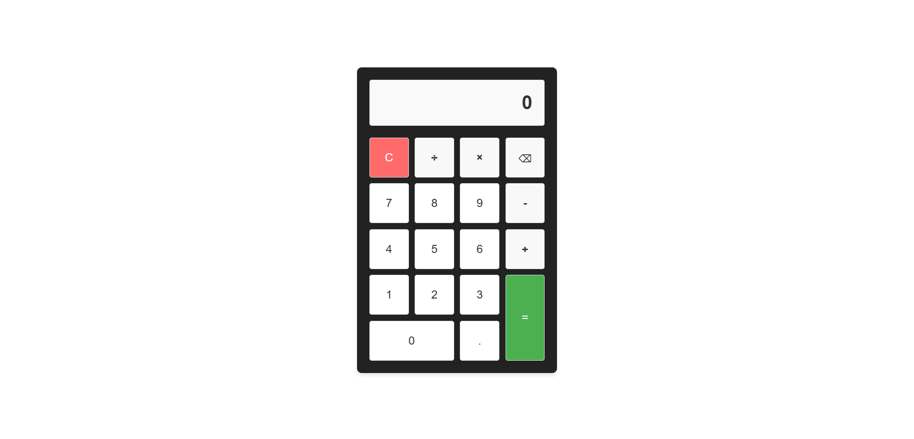

# Calculator Web App

A simple, responsive calculator built with **HTML**, **CSS**, and **JavaScript**.  
It supports basic arithmetic operations, keyboard input, error handling, and a clean UI design.

---

## Features

- ➕➖✖️➗ Perform basic arithmetic operations (addition, subtraction, multiplication, division)
- **Keyboard support** for numbers, operators, Enter (=), Backspace, and Escape (clear)
- Real-time display updates with formatted output
- Fully responsive design (works on desktop & mobile)
- Division by zero handling with error alert
- Smooth button press animations & modern UI styling

---

## Project Structure

```
calculator-app/
│── index.html
│── style.css
│── script.js
```

---

## Usage

1. Clone or download this repository.
2. Open `index.html` in your browser.
3. Use the on-screen buttons **or your keyboard** to perform calculations.

### Keyboard Shortcuts:

- Numbers (`0–9`)
- Operators (`+`, `-`, `*`, `/`)
- Decimal (`.`)
- `Enter` or `=` → Calculate
- `Backspace` → Delete last digit
- `Escape` or `C` → Clear display

---

## Live Preview

👉 [View Calculator](https://htmlpreview.github.io/?https://github.com/SaiPrakashReddyDendi/CODSOFT/blob/main/Calculator/index.html)

---

## UI Preview



---

## License

This project is open-source and free to use.
